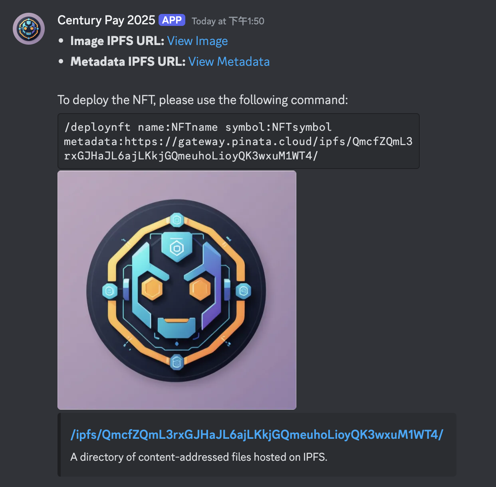

# Century Pay 2025

<p align="center">
<a href="https://discord.com/oauth2/authorize?client_id=1335065211597623316">

</a>
</p>

Century Pay 2025 is an **AI-powered Discord bot** that simplifies on-chain transactions and off-chain requests for users. It leverages Discord's **social features**, making it effortless for users to interact and engage with others.

Originally launched last year, [Century Pay](https://github.com/chengggkk/century-pay) enabled users to connect wallets, send ETH to Discord users, and execute transactions via AA wallets. Now, Century Pay 2025 takes it even further—with AI-driven automation, users can simply describe their request, and the bot seamlessly executes the transaction, making the experience smoother than ever. 🚀

## Example Features

Century Pay 2025 offers several powerful features, including:

-   **📂 IPFS Uploads**: Users can simply _upload an image through Discord_, and the AI agent will automatically handle the IPFS deployment. This eliminates the need for users to set up an IPFS server or write deployment code, making the process effortless.
-   **🎨 NFT Transactions**: Century Pay 2025 simplifies NFT deployment, minting, and transfers directly within Discord. Users only need to provide basic NFT details (e.g., name, symbol, and metadata URL) to deploy an NFT effortlessly.
    With Discord integration, users can:
    -   Share a **"Mint"** button with others to let them mint NFTs easily.
    -   `@Tag` other users to seamlessly transfer NFTs within the chat.
-   **🔒 ZK Integration**: Users can now generate zero-knowledge proofs (ZKPs) to interact with smart contracts seamlessly. Century Pay 2025 includes pre-built ZK circuits: Please checkout out [circuits](./circuits/README.md). It makes ZK applications more accessible and easy to use within familiar platforms like Discord.

## Technology Stack

-   [Agentkit](https://github.com/coinbase/agentkit): Agentkit is a framework for building AI agents. We enables the following features with Agentkit:
    -   **IPFS Uploads**: See [IPFS Uploads](./src/app/api/interactions/agentkit/ipfs.ts)
    -   **NFT Transactions**: See [NFT Transactions](./src/app/api/interactions/deployNFT/index.ts)
    -   **ZK Integration**: See [ZK Integration](./src/app/api/interactions/agentkit/zk/withdraw.ts)
-   [Base](https://www.base.org/): We deployed the ZK Poseidon Deposit smart contract on Base. See more details [here](./contracts/README.md).
-   [Automone](https://dev.autonome.fun/): We connect the Century Pay 2025 discord bot to a Automone agent.
    -   See more details [here](./src/app/api/interactions/autonome/index.ts)
    -   See the deployment server: [autonome](./autonome.ts)
-   [Covalent](https://github.com/covalenthq/ai-agent-sdk): We connect the Century Pay 2025 discord bot to a Covalent agent. We enables the following features with Covalent:
    -   **TokenBalancesTool**: See [TokenBalancesTool](./src/app/api/interactions/covalent/index.ts)
    -   **NFTBalancesTool**: See [NFTBalancesTool](./src/app/api/interactions/covalent/index.ts)
    -   **TransactionsTool**: See [TransactionsTool](./src/app/api/interactions/covalent/index.ts)
    -   **PortfolioTool**: See [PortfolioTool](./src/app/api/interactions/covalent/index.ts)

## ZK Poseidon Deposit Idea

To address the issue where a user hasn’t connected a wallet but someone else wants to send them ETH, we propose using a smart contract secured with zero-knowledge proofs (ZKPs). This ensures that only the intended recipient—who can generate the correct Poseidon hash—can withdraw the ETH. Below is an example workflow.


We integrated the ZK Poseidon Deposit smart contract with AI bots. It makes the ZKP more accessible and easy to use without installing any `snarkjs` or `circom` locally and even without understanding the ZKP.

In the future, we plan to integrate more ZKP applications with AI bots to make the privacy and security features more accessible to users. For example,

-   Tornado Cash enables anonymous transactions.
-   Semaphore enables anonymous membership control.
-   MACI enables anonymous voting.

## Features

### `/send`

Users can send ETH to other discord users with simply `@tag` a user and the amount of ETH they want to send.

-   Input

    -   `to` : the user to send ETH to
    -   `amount` : the amount of ETH to send

-   command
    

-   response
    

### `/wallet`

If a user hasn't connected a wallet, they can create a wallet with the `/wallet` command.
If a user has connected a wallet, they can check the balance of their wallet with the `/wallet` command.

-   command
    

-   create
    
-   check balance
    

### `/agentkit`

The agentkit command allows users to interact with the agentkit agent. It can handle the most general tasks, including the following `ipfs`, `nft`, `agentkit_twitter`, `zk_deposit`, `zk_withdraw`.

-   Input
    -   `prompt`: the task you want to perform.
-   command
    

### `/agentkit_twitter`

The agentkit twitter command allows users to draft a tweet post and share it on twitter(X).

-   Input
    -   `prompt`: the content you want to post on twitter(X).
-   command
    

### `/autonome`

### `/covalent`

The covalent command helps user use Covalent API to analyze on-chain data. And it shows some examples if `prompt` is empty.

-   Input
    -   `prompt`: the task you want to perform.
        -   Example prompt:
            -   Analyze the token balances for address karanpargal.eth on eth-mainnet...
            -   What NFTs does address karanpargal.eth own on eth-mainnet?
            -   Get daily portfolio balance for an address karanpargal.eth...
-   command
    
-   response
    

### `/ipfs`

The ipfs command allows users to upload an image to IPFS.

-   Input
    -   `file`: the image you want to upload.
-   command
    

-   response
    

### `/deployNFT`

The deployNFT command allows users to deploy an NFT.

-   Input
    -   `name`: the name of the NFT.
    -   `symbol`: the symbol of the NFT.
    -   `metadata`: the metadata of the NFT.
-   command
    

-   response
    

### `mint`

After deploying an NFT, users can mint the NFT to a user with the `mint` button. The `mint` button takes the user's wallet address as input and mint the NFT to the user.

-   command
    

### `/zk_deposit`

Follow the ZKP flow to deposit ETH to a user. See: [ZK Poseidon Deposit Idea](#zk-poseidon-deposit-idea)

-   Input

    -   `to` : the user to send ETH to
    -   `amount` : the amount of ETH to send

-   command
    
-   response
    

### `/zk_withdraw`

Follow the ZKP flow to withdraw ETH. See: [ZK Poseidon Deposit Idea](#zk-poseidon-deposit-idea)

-   command
    
-   response
    

## Install

```bash
yarn
```

-   Create a .env file

```bash
cp .env.example .env
```

See: [Discord Docs: Fetching your credentials](https://discord.com/developers/docs/quick-start/getting-started#fetching-your-credentials)

-   Register commands

```bash
yarn register
```

-   Run the server

```bash
yarn dev
```

## Deploy on discord

-   Start an ngrok tunnel

```bash
ngrok http 3000
```

-   Update the webhook url in the discord dashboard

Example url

```sh
https://<ngrok-id>.ngrok.app/api/interactions
```

See: [Discord Docs: Adding an interaction endpoint URL](https://discord.com/developers/docs/quick-start/getting-started#adding-an-interaction-endpoint-url)
